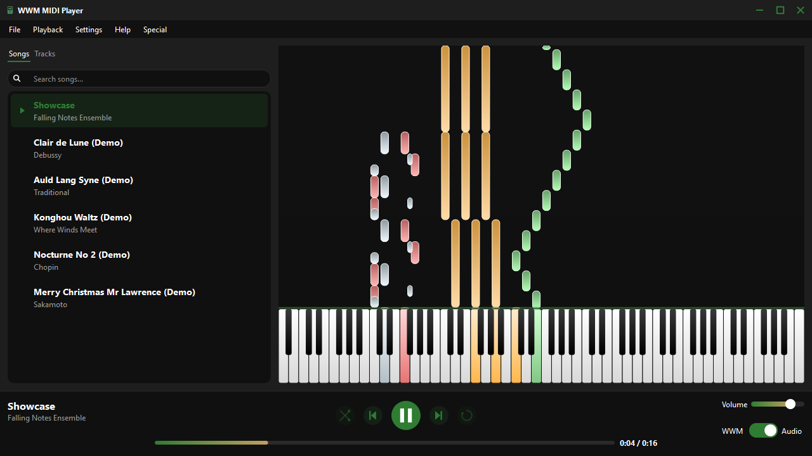
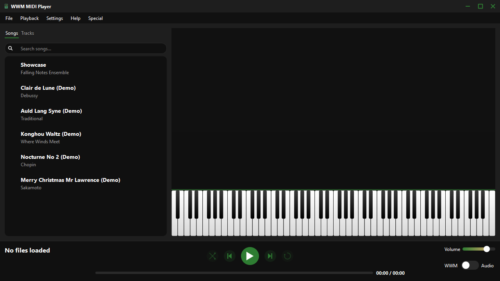
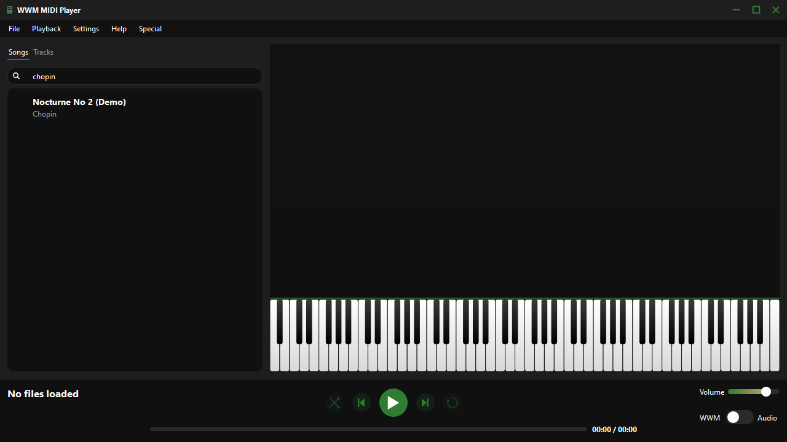
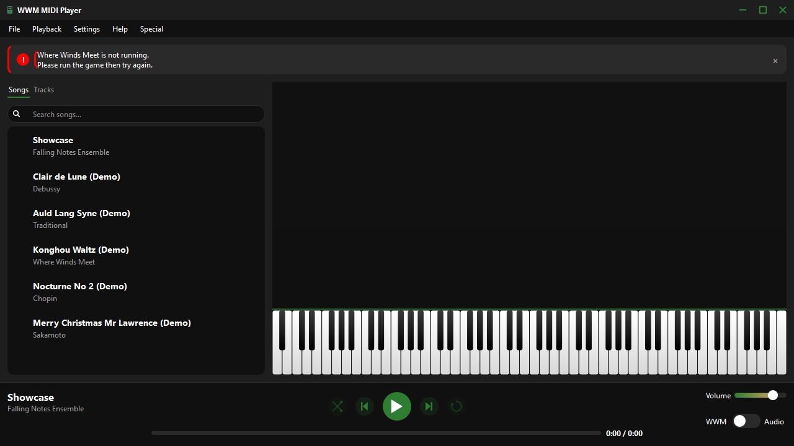
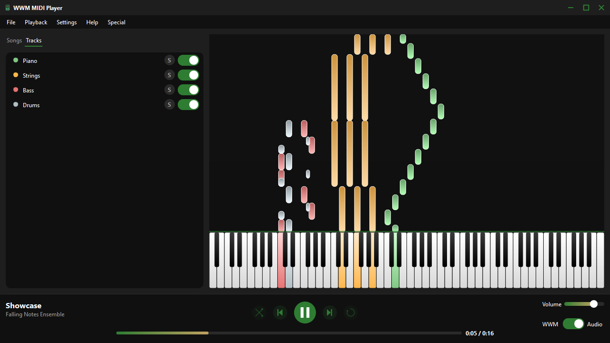
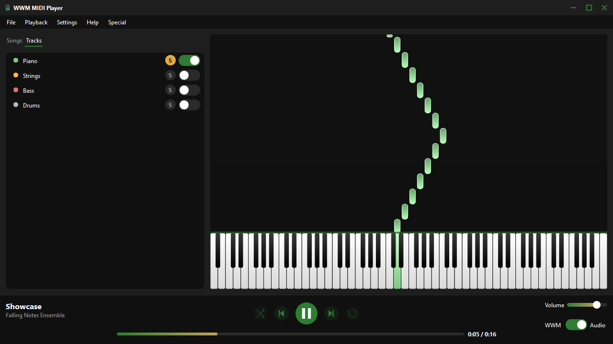
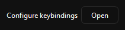
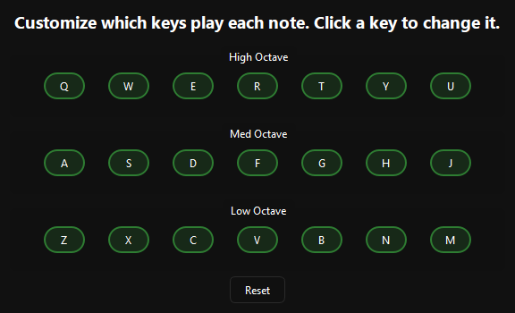

# WWM MIDI Player

A Windows desktop MIDI player built with PySide6. It plays MIDI files
through a bundled SoundFont like a normal player, but its real purpose is
**WWM mode**: it simulates keypresses into the game window for *Where Winds
Meet*, mapped to the in-game Konghou instrument's key bindings, so your
character performs the song live as it plays.



## Features

### Playlist

Load multiple `.mid`/`.midi` files into a playlist, search/filter by title
or artist, shuffle and repeat, and save/load playlists as `.m3u` files.
Titles and artists are parsed from filenames in `Artist - Title.mid` form.




### Two playback modes

- **Audio mode** plays through a bundled SoundFont, like a normal MIDI
  player — useful for previewing a track before performing it in-game.
- **WWM mode** posts synthetic keypresses into the *Where Winds Meet*
  window (matched by title), mapped to the game's Konghou key bindings, so
  your character performs the song live. This requires the game to already
  be running — if it isn't, the app tells you instead of failing silently:

  

Switch between the two anytime with the toggle in the now-playing bar or
the F8 hotkey.

### Falling-note piano visualizer

An 88-key keyboard with notes falling toward it in sync with playback,
colored per instrument **track** rather than MIDI channel — many files
route every instrument through the same channel, so coloring by channel
alone would make everything look identical.

### Per-track mute & solo

Switch to the **Tracks** tab next to the playlist to see every instrument
in the loaded file, each with a color swatch matching the visualizer, a
mute toggle, and a solo button. Changes apply live during playback, in
both Audio and WWM mode — mute the drums, solo the melody to learn it, etc.




### Seek

Click or drag anywhere on the progress bar to jump to that point in the
track, in either playback mode.

### Remappable WWM key bindings

Settings → Configure keybindings opens a per-note grid so you can rebind
any scale degree/register to a different key, matching your own in-game
control scheme instead of the default Konghou layout.




### Global hotkeys

F8/F9/F10/F11 work even when the game window has focus, so you don't need
to alt-tab back to the player mid-song:

| Shortcut | Action |
|----------|--------|
| F8 | Switch Audio/WWM mode |
| F9 | Previous track |
| F10 | Play/Pause |
| F11 | Next track |

### Settings persistence

Volume, Audio/WWM mode, and your playlist/selection are restored the next
time you launch the app.

### Special

The **Special** menu has a short credits screen thanking contributors.


## Requirements

- Windows (the app uses `pywin32` for game-window messaging and has no
  cross-platform fallback)
- Python 3.11–3.13, if running from source

## Installation

**Prebuilt installer:** grab the latest installer from the
[Releases](https://github.com/SergeyVasilyan/wwm-midi-player/releases) page
and run it.

**From source:** this project uses [uv](https://docs.astral.sh/uv/) for
environment/dependency management.

```powershell
# Install uv (skip if you already have it)
powershell -ExecutionPolicy ByPass -c "irm https://astral.sh/uv/install.ps1 | iex"

git clone https://github.com/SergeyVasilyan/wwm-midi-player.git
cd wwm-midi-player
uv venv --seed
.venv\Scripts\activate
uv pip install -e .
python src/app.py
```

## Usage

1. **File → Open MIDI file** to add tracks to your playlist (or **Load
   Playlist** to load a saved `.m3u`).
2. Double-click a track to play it.
3. Toggle **WWM / Audio** in the now-playing bar to choose whether playback
   simulates in-game keypresses (WWM mode requires *Where Winds Meet* to
   already be running) or plays through your speakers.
4. Switch to the **Tracks** tab to mute or solo individual instruments.
5. **Settings → Configure keybindings** to remap which keys each note sends
   in WWM mode.

## Contributing

See [CONTRIBUTING.md](CONTRIBUTING.md) for development setup, coding
standards, and the pull request process. Please also read our
[Code of Conduct](CODE_OF_CONDUCT.md).

## Security

See [SECURITY.md](SECURITY.md) for how to report a vulnerability.

## License

[GPL-3.0-or-later](LICENSE)
